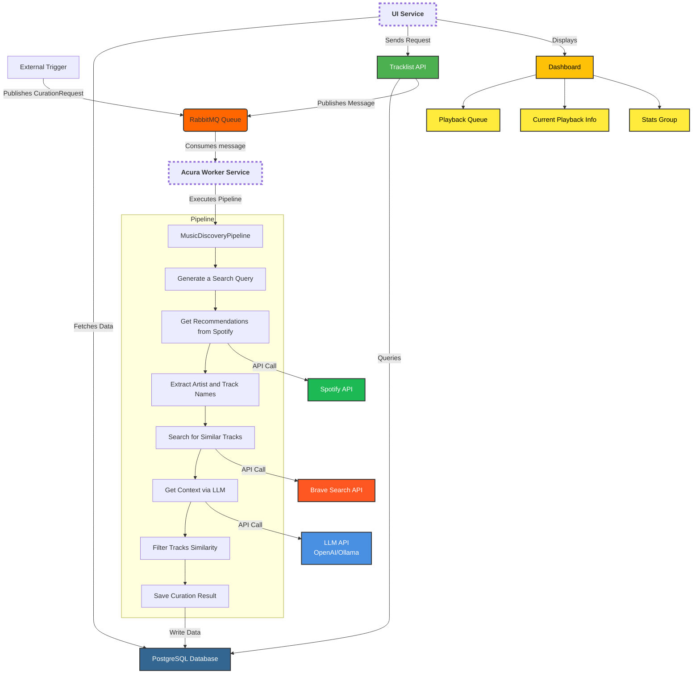

# Project EngineQ Monorepo

This repository contains the services and tools for Project EngineQ.

## Overview

This monorepo hosts Project EngineQ, a sophisticated music curation and playback system. It comprises several key components that work together:

*   **`acura/` (Acura Curation Engine):**
    This is an asynchronous Python backend service responsible for the intelligent curation of music playlists. It operates as a worker, listening for messages on a RabbitMQ queue ("acura").
    *   **Core Functionality:** When triggered by a message (containing a subscriber's license key), Acura fetches the subscriber's textual prompt (describing desired music ambiance) from PostgreSQL. It then employs a multi-step pipeline (`MusicDiscoveryPipeline` using `pydantic-graph`):
        1.  **AI-Powered Query Generation:** Uses an LLM (configurable: OpenAI `gpt-4o-mini` or a local Ollama model via `internal/agents/decide_llm()`) to transform the user prompt into effective search queries for Spotify.
        2.  **Dynamic Curation Strategy:** Generates embeddings (via OpenAI `text-embedding-3-large`) for the search query and leverages PostgreSQL with `pgvector` for similarity searches against existing curated tracks. It intelligently decides whether to find entirely new content or reuse/supplement existing similar content.
        3.  **New Content Discovery:** If new content is needed, it searches the Spotify API for relevant playlists. An LLM then validates if these playlists match the user's intent. For suitable tracks (non-explicit), it finds corresponding YouTube music videos via the Brave Search API, verifies their relevance (using Levenshtein distance), generates contextualized track embeddings, and stores the track metadata (title, YouTube URL, artist, duration, Spotify image) and embeddings in PostgreSQL.
        4.  **Existing Content Reuse:** If reusing content, it identifies similar tracks from the database (excluding those recently suggested) and adds them to the playlist.
    *   **Interface:** Primarily interacts via RabbitMQ messages. It does not expose HTTP APIs directly.
    *   **Key Technologies:** Python, `asyncio`, `aio_pika` (RabbitMQ), `asyncpg` (PostgreSQL), `pgvector`, `SQLAlchemy`, `pydantic-graph`, `pydantic-ai`, OpenAI API (LLMs and embeddings), Spotify API, Brave Search API.

*   **`ui/` (User Interface & User Backend):**
    This is a Next.js application that serves as the primary user interface and also handles direct user-facing backend logic.
    *   **Core Functionality:**
        1.  **User Onboarding & Authentication:** Provides a license-key based authentication system. Users sign in with their key, which is validated against the PostgreSQL database and stored in an HTTP-only cookie. Middleware protects dashboard and API routes.
        2.  **Music Playback Dashboard:** The main interface after login, featuring a music player, a dynamic playback queue, and display of current track information.
        3.  **Prompt Management:** Allows users to view and manage their music preference prompts (which `acura` uses for curation) via Server Actions that directly update the PostgreSQL database.
        4.  **Proactive Curation Trigger:** The UI monitors the user's playback queue. If the number of remaining tracks falls below a threshold (e.g., 10), the UI's backend (a Next.js API route at `/api/tracklist`) automatically sends a message to the `acura` RabbitMQ queue, requesting new content curation for that user.
        5.  **Playback Progress Tracking:** Updates the backend (`/api/update-last-played` Next.js API route) with the last track played by the user, allowing the system to serve only unplayed portions of playlists.
    *   **Architecture:** Acts as a "Backend For Frontend (BFF)". Its server-side capabilities (Next.js API Routes and Server Actions) interact directly with PostgreSQL for user-specific data and with RabbitMQ to trigger `acura`'s asynchronous processing.
    *   **Key Technologies:** Next.js (App Router), React, Tailwind CSS, HeroUI, Zustand (client-state), `@tanstack/react-query` (server-state), `postgres` (pg library for direct DB access), `amqplib` (RabbitMQ).

*   **`migrations/`**: Contains SQL database migration scripts. These are managed by `dbmate` and define the schema for the PostgreSQL database used by both `acura` and `ui`.

*   **`migrator/`**: This directory previously held `npm` configuration for `dbmate`. Now, it primarily contains `.env.example` for `dbmate`'s `DATABASE_URL`. The `dbmate` tool itself is executed via a Python script (`acura/scripts/run_dbmate_cli.py`) managed under the `acura` project's `uv` environment. This script automatically downloads the appropriate `dbmate` binary.

## Prerequisites for Development

*   **Python**: Version 3.11+ (as specified in `acura/pyproject.toml`).
*   **`uv`**: The Python package manager used for the `acura` backend and migration tooling. Install from [https://github.com/astral-sh/uv](https://github.com/astral-sh/uv).
*   **Node.js**: For the `ui/` frontend (check `ui/package.json` for specific version, e.g., >=18.x).
*   **`npm` or `yarn`**: For managing frontend dependencies.
*   **Docker & Docker Compose**: Recommended for running dependent services like PostgreSQL and RabbitMQ, and for containerized deployment.

## Architecture Overview Diagram

